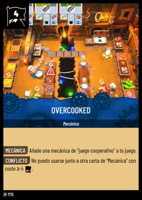
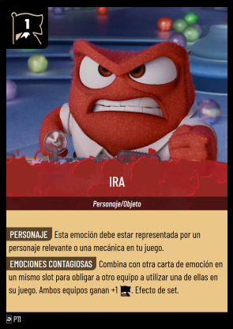
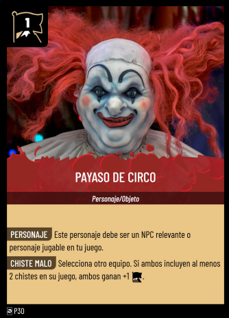
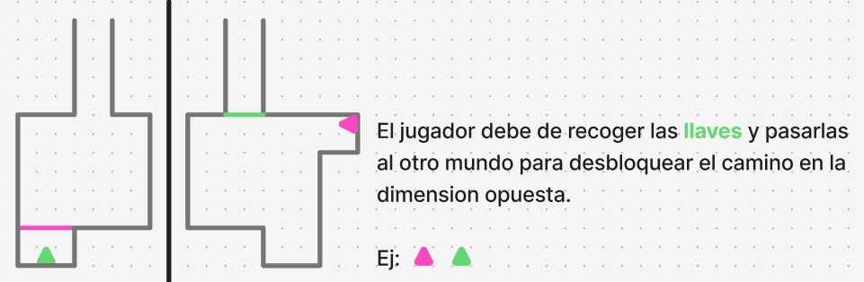
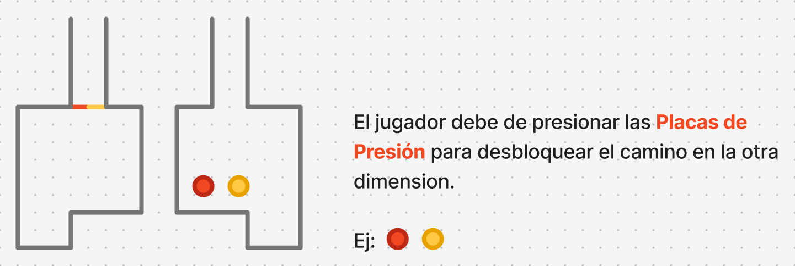
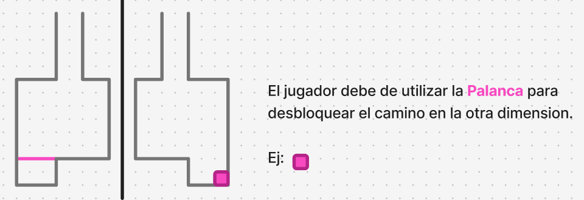
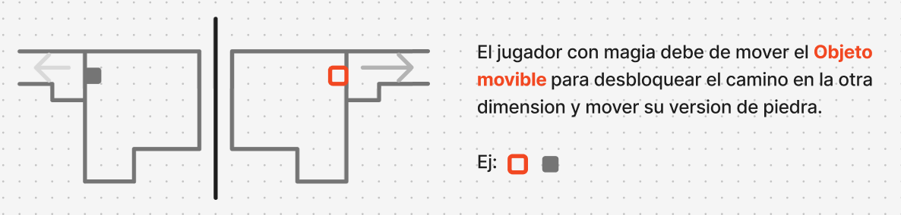
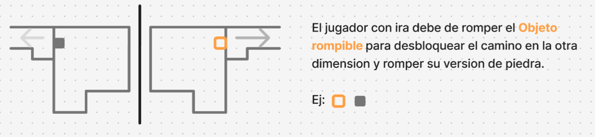
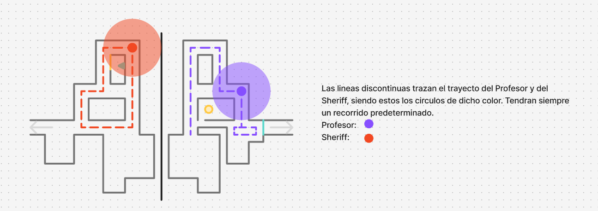
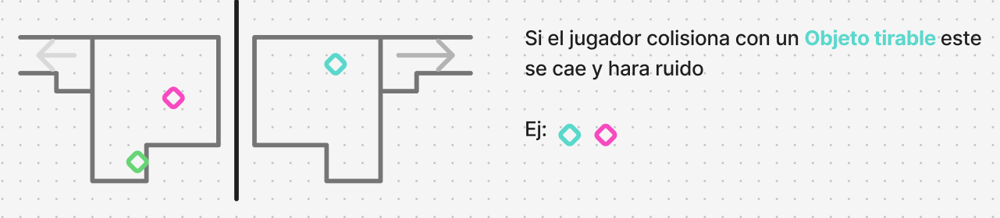

# GDD - RiftWest

**Documento de Diseño**

**Equipo de desarrollo:** 
- Integrante 1:Gabriel García
- Integrante 2:Inés de la Peña
- Integrante 3: Javier Librada
- Integrante 4: Alejandro Bueno

------------------------------------------------------------------------

## 1. Resumen

### 1.1 Descripción

En **RiftWest** jugarás como **Daphne** o **Percival**, que un día
inesperado tras la clase de encantamientos con el profesor **Filius
Flitwick** acaban en una misión interdimensional: volver a casa.\
Un fallo en la pronunciación de Daphne teletransporta a Percival a una
dimensión paralela del mágico mundo de **Magwarts**.\
Desde **Dustwarts**, Percival deberá encontrar el camino de vuelta a
casa con la ayuda de su amiga.

Un viejo amigo, **Xaverius Foramen**, será el encargado de ayudarte
durante esta misión para conseguir resolver todas las pruebas que la
brecha dimensional ha generado (siempre con su chispa de gracia tan
característica).

Explora los mundos de **Magwarts** y su versión paralela, **Dustwarts**,
y descubre la manera de hacer que Daphne y Percival se reencuentren
recorriendo los oscuros pasillos de ambos castillos, resolviendo
*puzzles* y haciendo amigos.

### 1.2 Género

Multijugador cooperativo de *puzzles*.

### 1.3 Setting

Un error en la clase de encantamientos hace que **Daphne** y
**Percival** se metan en una aventura interdimensional.\
La mala pronunciación de Daphne teletransporta a Percival a una
dimensión paralela del mágico mundo de Hogwarts.

Tras aterrizar en Dustwarts, Percival deberá de encontrar el camino de
vuelta a casa con la ayuda de su amiga.\
El juego consiste en un **Top-Down 2D cooperativo con pantalla
dividida**, en el que cada personaje se encuentra en una dimensión
diferente y tendrán que trabajar juntos para resolver *puzzles* y lograr
su objetivo: volver a juntarse.

### 1.4 Cartas Jugadas

 ------------------ ---------------- ------------------- --------------
         
       

------------------------------------------------------------------------

## 2. Mapas, Estética y Ambientación

### 2.1 General

Los mapas estarán divididos en *tiles*, pero el desplazamiento será
libre.\
Esto significa que no te moverás de casilla en casilla, sino que podrás
moverte con fluidez sin estar limitado por ellas.\
Los personajes tendrán un tamaño de **1x1 tiles**, de modo que, cuando
se encuentren en el centro de una de estas, su *sprite* encajaría
perfectamente dentro.

En cambio, los objetos (tanto los interactuables como los decorativos)
estarán fijados sobre las *tiles* para facilitar la coherencia espacial
y el diseño del escenario.

### 2.2 Dustwarts

Esta dimensión presenta una ambientación inspirada en el **salvaje
oeste** y sus mapas están basados en el interior de antiguas tabernas y
salones del oeste.\
Los colores predominantes serán tonos cálidos y terrosos (ocres,
marrones y naranjas), reforzando la sensación de sequedad y hostilidad
del entorno.\
La arquitectura será rústica, con construcciones de madera desgastada y
estructuras simples, además de elementos decorativos clásicos del oeste
como barriles y mesas con cartas o alcohol.

### 2.3 Magwarts

En contraste, esta dimensión estará inspirada en un entorno **mágico y
académico**, similar a una escuela de hechicería.\
Sus escenarios se basarán en interiores de **castillos góticos**,
bibliotecas infinitas y laboratorios de alquimia.\
Los colores predominantes serán fríos y misteriosos (azules, púrpuras y
verdes esmeralda), transmitiendo una atmósfera enigmática y
sobrenatural.

Los objetos decorativos podrán incluir calderos burbujeantes, libros
arcanos y cuadros animados.

[**Asset pack para ambos**](https://assetstore.unity.com/packages/2d/environments/2d-topdown-interior-tileset-rogue-adventure-238444)

### 2.4 Música

La música del juego será una combinación de ambos mundos.\
Tendrá instrumentos relacionados con el **antiguo oeste** (guitarras,
armónicas, viento, silbido del tren) y también instrumentos **mágicos o
de fantasía** (coros etéreos, cuerdas, susurros, campanillas y
destellos).

------------------------------------------------------------------------

## 3. Mecánicas

### 3.1 Mecánicas de Personajes

Tanto **Percival** como **Daphne** cuentan con mecánicas propias que
afectan al entorno de ambas dimensiones.

#### Percival

-   **Ira Concentrada**:\
    Puede romper ciertos barriles al acercarse e
    interactuar con ellos.\
    Estos objetos se encuentran en ambas dimensiones en la misma
    posición relativa, por tanto, al romperlos en una se romperán
    también en la otra.\
    Al acercarte a estos con Percival se pondrán a parpadear.

#### Daphne

-   **Movilidad Inalámbrica**:\
    Puede mover ciertas cajas de madera.\
    Al moverlos en una dimensión, también se moverán en la otra (si
    existen en ambas).\
    Al acercarte a estos con Daphne se pondrán a parpadear.

------------------------------------------------------------------------

### 3.2 Inventario

Los jugadores podrán recoger objetos como llaves .\
Estos se guardarán en su inventario personal, con un límite de
capacidad.\
Podrán usarlos para interactuar con el entorno o transferirlos entre
dimensiones a través del payaso **Xaverius Foramen**.

------------------------------------------------------------------------

### 3.3 Personaje de Payaso (Xaverius)

Desde el inicio se podra usar la habilidad de **transferir objetos
entre Percival y Daphne**.\
Podrás invocar al payaso con la tecla **Q** y **Alt Gr**,entonces se mostrará el inventario y 
podrás elegir que objeto transferir.\
El payaso entonces obtendrá el objeto que le des
y podrás obtenerlo desde la otra dimensión interactuando de nuevo con él\
Además, contará chistes, reflejando su graciosa personalidad.

------------------------------------------------------------------------

### 3.4 Dimensiones "entrelazadas"

Las acciones realizadas en una dimensión afectarán a la otra.\
Por ejemplo, los objetos que se rompan en una también se romperán en la
segunda.\
Este mecanismo facilitará la resolución de los *puzzles*.

------------------------------------------------------------------------

### 3.5 Puzzles

#### Puertas con llaves

Existen puertas bloqueadas que requieren **llaves ocultas**,
muchas veces escondidas en la dimensión opuesta.\
Esto obliga a los jugadores a comunicarse para compartir información
clave.

#### Plataformas Levadizas

Plataformas que pueden iniciar estando levantadas o bajadas.\
Su estado cambia al interactuar con placas de presión. Si el jugador pasa 
sobre una plataforma que está bajada el nivel se reiniciará.\

#### Placas de presión

Tiles que se activan al pasar por encima o al colocar una caja.\
Pueden abrir puertas o plataformas.

#### Palanca

Se activa al pasar por encima de ella, abriendo mecanismos como
puertas o suelos.

#### Objetos recogibles
A este conjunto de “Objetos Recogibles” pertenecen los siguientes objetos:
    - LLaves
Se recogen colisionando con ellos, estos se almacenarán en el inventario
del personaje correspondiente.\
Si el inventario está lleno, el objeto permanece en el suelo.

#### Objetos Movibles

Se mueven con **Shift Derecho (Daphne)**.\
Parpadean al acercarse a ellos con Daphne y están relacionados entre dimensiones.

#### Objetos Rompibles

Se rompen con **Shift Izquierdo (Percival)**.\
Parpadean al acercarse a ellos con Daphne y están relacionados entre dimensiones.

#### Vigilantes

Nivel 3 introduce a los **vigilantes**: - Profesor (Magwarts)\
- Sheriff (Dustwarts)

Tienen rutas asignadas.\
Si el jugador entra en su radio de visión, se reinicia el nivel.\

#### Objetos Tirables
Caen al colisionar y aumentan el area de vision de los vigilantes.\
Este aumento de vision de los vigilantes es temporal.

------------------------------------------------------------------------

## 4. Niveles y Lore

### 4.1 Nivel 1
Muestra varias de las mecánicas base del juego como: el traspaso de objetos entre 
inventarios, las habilidades de los personajes, las plataformas levadizas y 
las placas de presión.

### 4.3 Nivel 2

Se introducen los vigilantes y siguen apareciendo el resto 
de mecánicas, excepto las plataformas levadizas.\
Objetivo: **escapar del sheriff y el profesor**.\

### 4.5 Nivel 3

Objetivo: **encontrar la salida de la clase y la comisaría**.\
Ambos deben conseguir las llaves del despacho del profesor.\
- **Daphne:** evita al profesor.\
- **Percival:** evita al sheriff.\
------------------------------------------------------------------------
