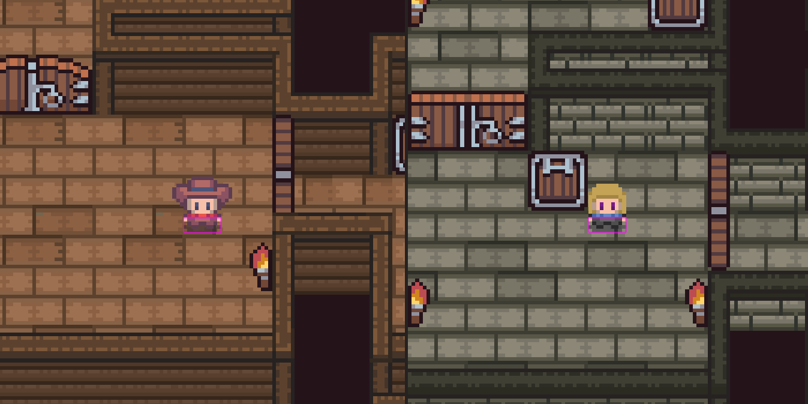
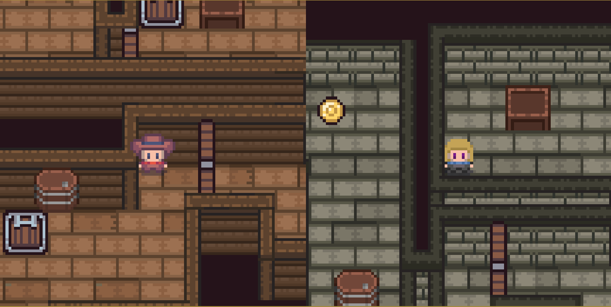
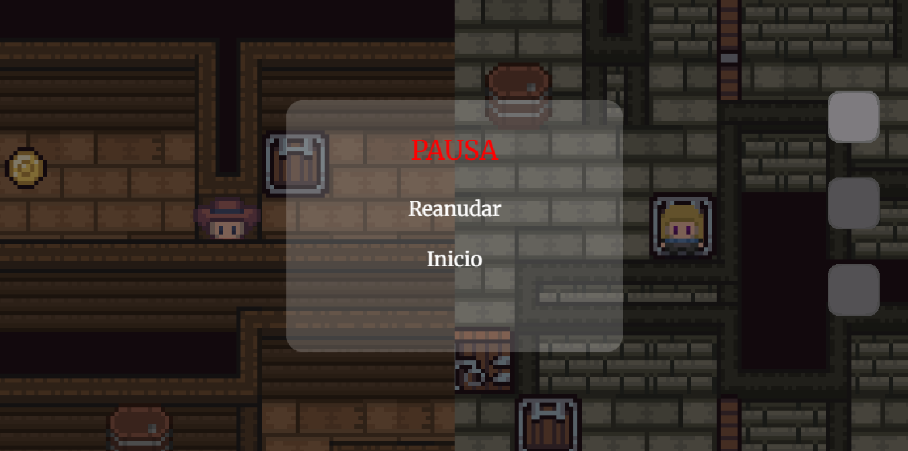

# 🪄Rift West🥊

>Este proyecto forma parte de un trabajo universitario para el Grado de Desarrollo de Videojuegos de la UCM.

## Descripción del juego  

**Rift West** es un juego de puzles 2D cooperativo local en el que controlas a Percival y a Daphne, dos estudiantes de la escuela de magia de Magwarts. El objetivo es superar los distintos puzles para conseguir que ambos se puedan reencontrar después de que Percival fuese mandado por error a otra dimensión, para ello deberás hacer uso de la mecánica especial de cada uno y de los distintos objetos del mapa.

---

## Setting

A causa de un hechizo fallido de Daphne, Percival fue mandado a otra dimensión sin su varita mágica. Por suerte de alguna manera siguen pudiendo comunicarse entre dimensiones, y pronto descubren que lo que sucede en una afecta a la otra también. Así, ambos se disponen a encontrar la manera para traer a Percival de regreso.

---

## 🖼️ Imágenes del Juego

## Redes Sociales

Podéis encontrarnos en [Twitter(X)](https://x.com/67studio\_\_), intentaremos ir actualizando con avances del proyecto.

[Probadlo](https://gabuu0.github.io/RiftWest\_PVLI), aún está en desarrollo pero hay mecánicas chulas para probar.

