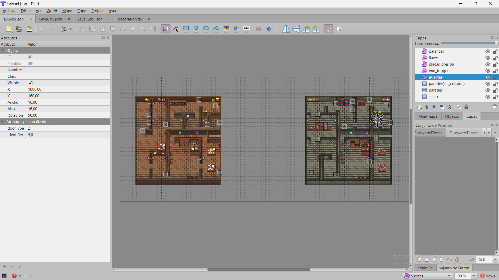
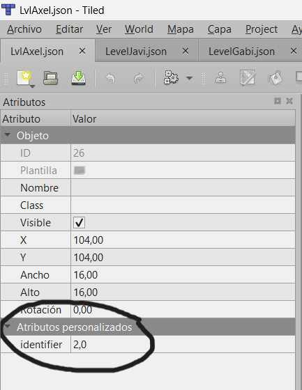

# ARCHITECTURE
## Introducción
Este documento describe la arquitectura interna del proyecto, incluyendo la estructura de carpetas, los módulos principales, el flujo interno del juego y el diagrama de arquitectura.
Este juego es un trabajo universitario desarrollado por 67Studio.
## Tecnologías utilizadas
El proyecto ha sido desarrollado utilizando un conjunto de tecnologías web modernas orientadas a la creación de juegos 2D y a la publicación en línea:

**HTM**L: Se encarga de la estructura principal de la página web y del contenedor donde se integra el juego.

**CSS**: Utilizado para el diseño visual de la interfaz, la disposición de los elementos y la presentación general del sitio web del proyecto.

**JavaScript**: Lenguaje principal de programación del juego, responsable de la lógica, interacción y funcionamiento interno.

**Phaser (librería JavaScript)**: Motor de desarrollo de videojuegos 2D empleado para manejar escenas, físicas, sprites, animaciones y colisiones, proporcionando una base sólida para el gameplay.

**Tiled**: Herramienta usada para la creación y edición de mapas, facilitando el diseño de niveles mediante tilesets.

**GitHub Pages**: Plataforma usada para el despliegue del juego, permitiendo publicar una versión jugable accesible desde cualquier navegador.
## Estructura de carpetas
```
/
|-- index.html
|-- estilo.css
|-- README.md
|-- architecture.md
|-- GDD.md
|-- assets.md
|-- LICENSE

|-- /lib
|     |-- phaser.js

|-- /sprites
|     |-- images/
|     |-- logos/
|     |-- tileSet/

|-- /sounds

|-- /gdd
|-- /imagesGDD

|-- /src
      |-- game.js
      |-- /scenes
      |     |-- main.js
      |     |-- bootScene.js
      |     |-- pauseMenu.js
      |     |-- inventories/
      |     |-- levels/
      |
      |-- /players
      |     |-- movement.js
      |     |-- players.js
      |
      |-- /objects
            |-- mapObjects/
            |-- playerObjects/


```
## Descripción de los módulos principales
**1. game.js**

Archivo principal que inicializa la configuración general del juego.
Define el tamaño del canvas, activa Phaser y carga las escenas iniciales.

**2. /src/scenes**

Contiene todas las escenas del juego. Cada escena representa un estado distinto del gameplay.

**bootScene.js**:
Escena encargada de cargar assets, sprites, mapas y prepararlo todo antes de iniciar el juego.

**main.js**:
Escena principal del juego donde se desarrolla el gameplay: movimiento, colisiones, interacción con objetos, enemigos, etc.

**pauseMenu.js**:
Escena que gestiona el menú de pausa, permitiendo detener el juego y navegar opciones.

**/levels**:
Contiene escenas específicas de niveles creados con Tiled.

**/inventories**:
Maneja la lógica del inventario, objetos recogidos y equipados.

**3. /src/players**

Módulo especializado en la lógica del jugador.

**players.js**: creación del jugador, animaciones y físicas.

**movement.js**: controla el sistema de movimiento, input y velocidad.

**4. /src/objects**

Contiene todos los objetos que aparecen en el juego.

**mapObject**s: objetos estáticos o colocados desde Tiled.

**playerObjects**: objetos que el jugador puede recoger, usar o interactuar con ellos.

**5. /sprites**

Carpeta que contiene imágenes, iconos, logos y tilesets usados por Tiled y por Phaser.

**6. /sounds**

Módulo donde se almacenan los efectos de sonido y música del juego.

**7. /lib/phaser.js**

Librería del motor Phaser, utilizada para la construcción del juego.

### Capas de tiles
- **Capa de suelo:** No presenta colisiones, y sirve únicamente como fondo del nivel.  
- **Capa de paredes:** Contiene los tiles con los que los personajes colisionan, definiendo los límites del mapa.  
- **Capa de paredes sin colisión:** Incluye elementos visuales que se superponen a los personajes, generando el efecto de que estos se encuentran “detrás” de ciertos objetos.

### Capas de objetos
- Los objetos se organizan en capas para facilitar la creación del mapa.  
- Esto permite que el juego lea automáticamente la posición de los objetos desde los archivos `.json`, evitando tener que colocarlos manualmente mediante código.
- Además, en Tiled asignamos un **identifier** único a cada puerta, placa, palanca u otro objeto interactivo.  
  Esto permite que, cuando por ejemplo se active una placa de presión el juego busque automáticamente todas las puertas que compartan el mismo identificador, de modo que se abran correctamente.  
  De esta manera, se mantiene una relación directa y organizada entre cada activador y los objetos que controla.

- Las puertas también cuentan con un atributo llamado **doorType**, que determina qué sprite de puerta se utilizará en el juego.






